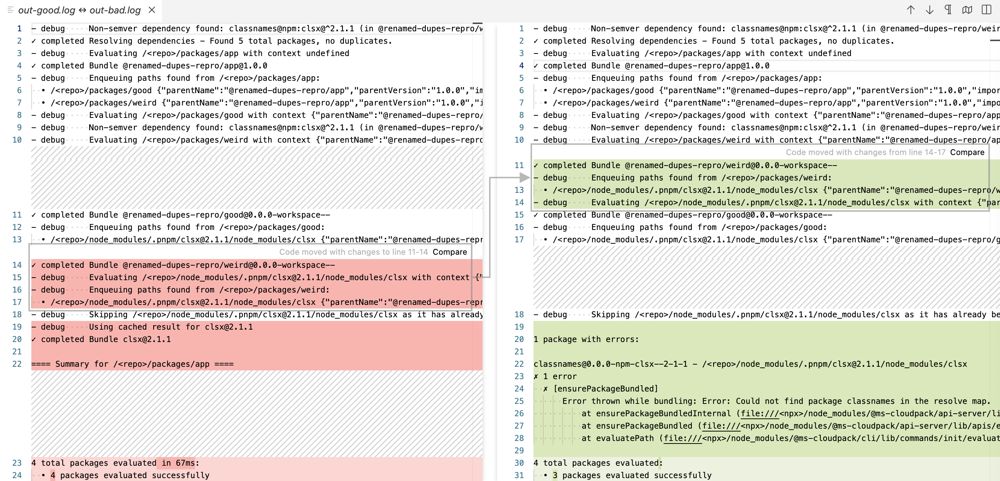

## Setup

- `packages/good` depends on `"clsx": "^2.1.1"`
- `packages/weird` depends on `"classnames": "npm:clsx@^2.1.1"`

The pnpm store has a single entry `node_modules/.pnpm/clsx@2.1.1/node_modules/clsx`.

This store entry is linked to both `packages/good/node_modules/clsx` and `packages/weird/node_modules/classnames`.

`packages/app` depends on `good` and `weird`.

Run `pnpm run cloudpack:init` in `packages/app`. (This runs cloudpack via `npx` so the repo's `node_modules` structure is easier to see.)

## Bug

About 50% of the time, you'll get an error like this:

```
classnames@0.0.0-npm-clsx--2-1-1 - /<repo>/node_modules/.pnpm/clsx@2.1.1/node_modules/clsx
✗ 1 error
  ✗ [ensurePackageBundled]
      Error thrown while bundling: Error: Could not find package classnames in the resolve map.
          at ensurePackageBundledInternal (file:///<npx>/node_modules/@ms-cloudpack/api-server/lib/apis/ensurePackageBundled.js:68:15)
          at ensurePackageBundled (file:///<npx>/node_modules/@ms-cloudpack/api-server/lib/apis/ensurePackageBundled.js:16:65)
          at evaluatePath (file:///<npx>/node_modules/@ms-cloudpack/cli/lib/commands/init/evaluatePath.js:20:30)
```

The resolve maps and bundle inputs and outputs are identical. The difference appears to be **which of `good` or `weird` finishes bundling first**, and therefore which one gets precedence for enqueueing the (actual) single copy of `clsx`.

